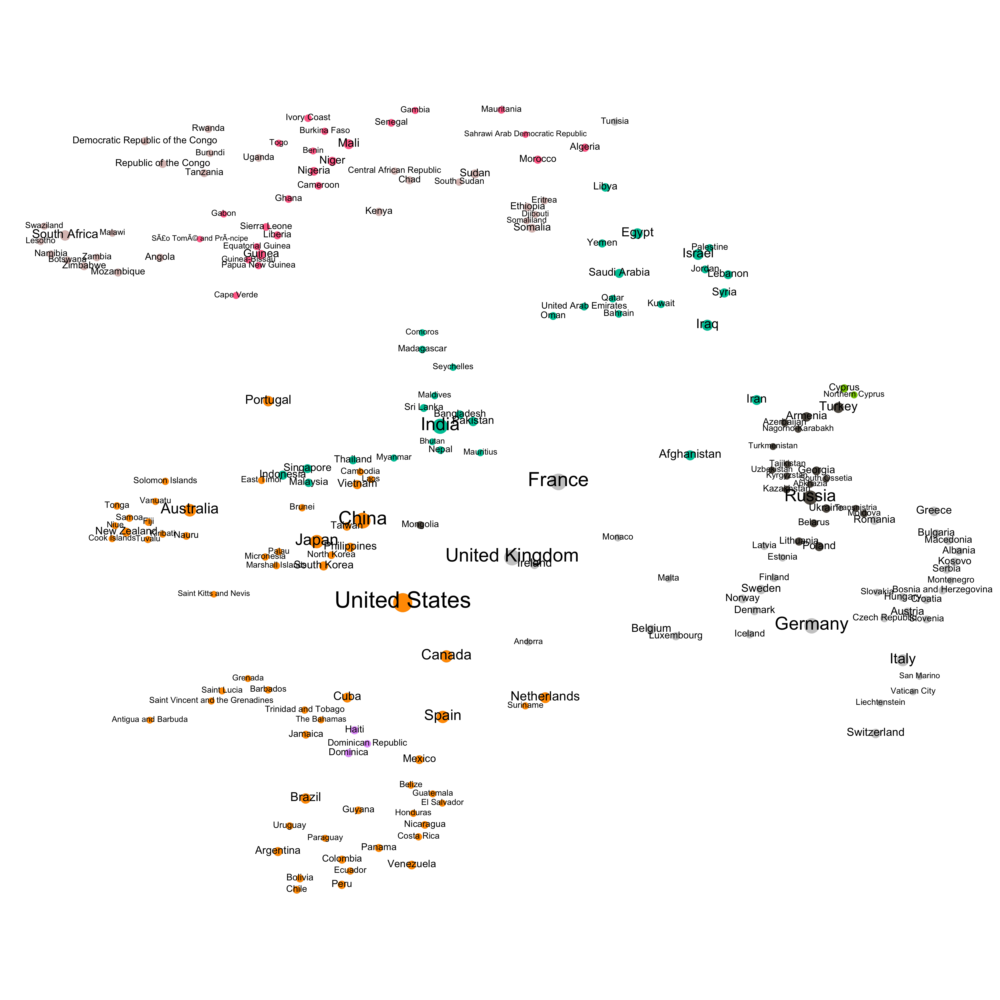

href='index.html'>Home</a> 

# I clustered countries by Wikipedia references - here's what happened

A few days ago I decided I didn't know enough about the relationships between
countries on the World stage. To get myself up to date I made a few different
'study guides' where I grouped countries by all sorts of things -- power index,
region, GDP, quality of life. After sorting the countries this way I thought I'd
be able to start somewhere and begin reading the Wikipedia pages for all the
countries, fleshing out my knowledge of the world little by little.

Sorting by these arbitrary things helped, but there was some countries that were
hard to group and I figured that since I planned to begin my search for
knowledge by using Wikipedia, I should ask Wikipedia what it thought. I visited
the page that lists sovereign nations and included all of them (including the
heavily contested ones), there were 207. Then I started writing a little code...

You can see the [full code on
GitHub](https://github.com/buckmaxwell/wiki-country-scrape), but basically, I
went through the country pages one by one, and on each country page I searched
for references to the other countries, building weighted relationships between
the countries. I then loaded this information into a tool called
[Gephi](https://gephi.org/) (which is open source and free!) and tried my hand
at creating a useful visualization.

Displaying lines proved to be futile pretty quickly. Regardless of how I
organized by graph, the countries were so interconnected that it was impossible
to follow the lines, regardless of what wacky magic I tried to apply. I ended up
finding the Gephi's force Atlas 2 algorithm to be quite useful for the
visualization. It makes heavy use of edge degrees, grouping highly connected
nodes close together. I used it in LinLog mode, which creates tighter clusters.
You can read more about the algorithm
[here](https://github.com/gephi/gephi/wiki/Force-Atlas-2). Using Force Atlas 2,
clear clusters began to emerge. It now seemed unnecessary to leave all the lines
in, since proximity told the same tale. I removed them.

Finally, I ran the modularity class algorithm with default settings a few times
and colored the nodes accordingly. Interestingly, the modularity class told a
slightly different story than simple proximity did. Take Portugal for example.
Portugal has a great deal in common with Spain, its nearest neighbor, and a
country with whom it has feuded over the border with throughout history. Most of
the time, geographic proximity relates to distal proximity on the graph, but in
the case of Portugal it did not. Portugal is floating down and significantly
left of Spain. You'll notice it's color, however, is shared with Spain.
Something must be "pulling" it left. A Wikipedia search for Portugal will reveal
that the Portuguese empire colonized a lot of Africa including Guinea, Angola,
and Mozambique. So the color and the position of the node both tell interesting
stories. I left them both.

The size of the nodes is based on the in-degree, or number of times other
countries pages mentioned the country. Here is a picture of my results ([see
GitHub for full PNG and PDF
files](https://github.com/buckmaxwell/wiki-country-scrape)). If you like this
let me know, I may continue posting on this topic soon.

*NOTE: a previous version of this post included a different version of the same
graph that was slightly different. The older version is still available on
GitHub but is less legible.*

<a href=how-many-seasons.html>Prev</a> <> Next

---

 <a
href='resume.html'>Resume</a> 

---

(c) 2016 maxbuckdeveloper@gmail.com
