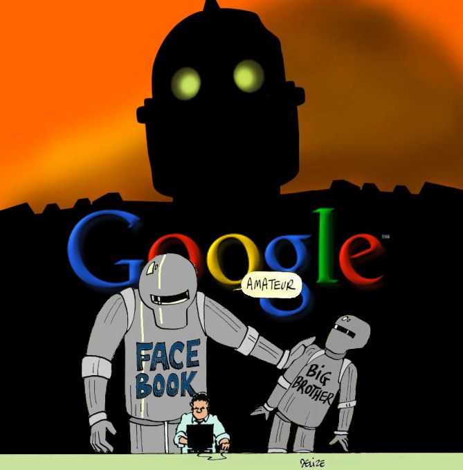

  <a href='maxwellbuck.pub'>PGP</a>
  •
  <a href='fb-highlights.html'>Thoughts</a>
  •
  <a href=INDEX.md>Raw</a>
  •
  <a href='index.html'>Home</a>
  

# Cool Thoughts Sometimes.

Occassional ramblings from me, Max. I am a programmer, poet, and a friendly litt
le guy from Cleveland.  There are no ads on this site, no popups, no javascript,
 and no like or share buttons.  There is however one little cookie that I hope y
ou'll indulge in. Enjoy. 

02.24.2018
<h2><a href=welcome-to-the-ant-hill.html>I think we should be m
ore ant like  </a></h2>

12.10.2016
<h2><a href=google-analytics-aint-that-slick-hom
ie.html>Is Google Analytics really that slick?</a></h2>

12.04.2016
<h2><a href=whats-with-the-new-blog.html>What's with
 the new blog?</a></h2>

11.30.2016
<h2><a href=countries-by-wikipedia.html>I cl
ustered countries by Wikipedia references - here's what happened</a></h2>

09.20.2016
<h2><a href=how-many-seasons.html>How many seasons 
are there really?</a></h2>

09.29.2015
<h2><a href=background-by-reddit.html>Background By Reddi
t</a></h2>

09.15.2015
<h2><a href=json-api-2.html>Using the Json Api Specificatio
n, Part 2: NeoAPI</a></h2>

09.14.2015
<h2><a href=zipcode-magic.html>Zip Code M
agic</a></h2>

09.10.2015
<h2><a href=json-api-1.html>Using the Json Api Speci
fication, Part 1</a></h2>

---

  <a href='https://www.linkedin.com/pub/max-buck/8b/5b8/a9'>LinkedIn</a>
  •
  <a href='resume.html'>Resume</a>
  •
  <a href='https://github.com/buckmaxwell'>GitHub</a>

---

(c) 2018 maxbuckdeveloper@gmail.com
