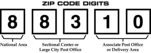

# Zip Code Magic

A while back I got to thinking about how we deal with zip codes as programmers. 
 As a backend developer with a preference for [PostgreSQL](http://postgresql.org
) I was always a bit stunned that Postgre didn't have an explicit datatype for z
ip codes.  Everything gets a type in Postgre, from UUIDs to geometric shapes use
d for geo fencing.  You may be wondering why I would make a stink about somethin
g so simple.  The USA uses 5 digit numbers to refer to specific regions of the c
ountry by a unique name. Store it as an integer and call it a day right? Well yo
u could, and it would work most of the time, and pretty well.  Thing is, Zip cod
e information provides much more than we usually allow it.

<p align="center"></p>

The first digit of a zip code specifies a region.  This digit can be 0-9.  That'
s right, zip codes in the US Territories, and the North Eastern United States ar
e less than 5 digits long if you store them as integers.   You could always stor
e them as integers and then pad the front with zeroes if you ever need to print 
them, but there are some advantages to storing the zip code as a string, dependi
ng on application.

<p align="center"></p>

A Zip code as a string of 5 digits allows us to leverage the SQL LIKE clause.  T
his comes in handy when looking for zip codes that match a given prefix.  While 
the first digit will correspond to a region, digits 1-3 or the 3 digit zip code 
refers to a "Sectional Facility Centers".  These facilities often include zip co
des from just one city, and rarely, are cities split across centers.  It can hap
pen though, and it does.  Three different sectional facility centers serve New Y
ork City.  The next two specify specifically the zip code region, and the final 
4 digits (if they are added) refer to a specific address.

<p align="center"></p>

Since zip code data is public, I dug up the latest [mammoth CSV file](http://fed
eralgovernmentzipcodes.us/) from the government archives and put together a pyth
on package for quickly finding zip code info based on full or partial zip codes.
  The information was last updated in 2012 so it is not perfect -- I hope to fin
d a newer one soon.  The package I built is incredibly simple, but it is quick a
nd powerful when used properly.  Right now, by supplying a full or partial 5 dig
it zip code, you can fetch "zip code objects" which can  be used to give informa
tion about population, wages, taxes, geospatial positioning and more.  This pack
age is utilizes no API and so is applicable an fast on both the front and backen
d.  I plan to add more functions to increase its usefulness.

```sh
$ pip install zipcode

$ python

>>> import zipcode

>>> cbus_zips = zipcode.islike('432') #=> list of zip code objects in '432' sect
ional facility.

>>> zipcode.isequal('44102').location_text #=> 'Cleveland, OH'
```

The package is available on [PyPi](https://pypi.python.org/pypi?%3Aaction=pkg_ed
it&name=zipcode) and on https://github.com/buckmaxwell/zipcode.

Update 9/14/2015:  I've added some new functionality.  The docs are up on http:/
/pythonhosted.org/zipcode/.

